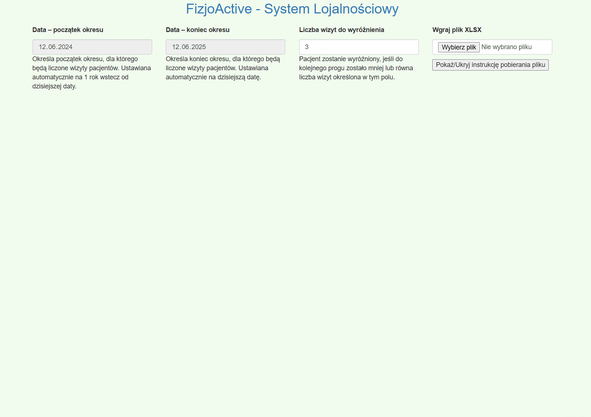

# FizjoActive – Loyalty System

[](https://www.gnu.org/licenses/gpl-3.0)
[](https://getbootstrap.com/)
[](https://bootstrap-table.com/)
[](https://jquery.com/)
[](https://github.com/SheetJS/sheetjs)
[](https://danzigerrr.github.io/Automated-Patient-Loyalty-Tracker/)


This project provides a **client-side web application** for analyzing patient visit 
data from an XLSX file and applying predefined loyalty rules. 
It generates a **dynamic report table** with robust filtering and 
sorting capabilities to help manage patient statuses and discounts.
The XLSX file should be exported from [Medfile system](https://www.medfile.pl/), 
which stores information about patient visits.

The app is hosted using GitHub Pages: [Link](https://danzigerrr.github.io/Automated-Patient-Loyalty-Tracker/).

---

## 🛠️ Functionality

The FizjoActive Loyalty System helps you:

- **Upload XLSX Data**  
  Easily import patient visit data from a XLSX file using the [Medfile](https://www.medfile.pl/) format.

- **Process Patient Information**  
  Automatically parse patient names, surnames, and visit details.

- **Apply Loyalty Rules**  
  Calculate loyalty statuses and discounts based on configurable rules (e.g., *"30+ Wizyt"*, *"Roczni Lojalni"*).

- **Determine Status Expiration**  
  Track when a patient’s loyalty status is set to expire.

- **Generate Dynamic Report Table**  
  Display processed patient data in an interactive table.

- **Flexible Filtering**:
    - **Patient Search**: Quickly find patients by name and surname using an input field.
    - **Multi-Select Status Filter**: Filter patients by their _"Obecny status"_ using a custom dropdown with **"Select All"** and **"Deselect All"** options.
    - **Multi-Select Threshold Filter**: Filter patients by _"Wizyty do zmiany statusu"_ similarly using a custom dropdown.

- **Persistent Sorting**  
  The table intelligently remembers and reapplies your chosen sorting preferences even after filtering.

- **Configurable Highlight Threshold**  
  Highlight patients who are a set number of visits away from reaching the next loyalty threshold.

---

##  ️🎬 Demo
This demo briefly presents the key functionalities of the system.
The example XLSX file used in the demo can be found in the `demo` folder.



---

### 📊 Loyalty Rules
The loyalty rules are defined in `js/config.js` and can be customized as needed.
The system applies loyalty discounts based on the number of visits within a defined period. 

The rules are as follows:

| Rule Name                    | Visit Range    | Discount | Validity Period |
|-----------------------------|----------------|----------|-----------------|
| 30+ Wizyt                   | 30 or more     | 10%      | 365 days        |
| Roczni Lojalni - Grupa 1    | 10–19 visits   | 5%       | 90 days         |
| Roczni Lojalni - Grupa 2    | 20–29 visits   | 10%      | 180 days        |

---

### 🔄 Step-by-Step Data Flow

#### 1. **Date Range Selection**
- Default dates:
    - **Start**: One year prior to today.
    - **End**: Today.
- Used to filter visits within this period.

#### 2. **XLSX File Upload (`handleFile` function)**
- Users upload an XLSX file with patient records.
- `XLSX.read` parses the file into a worksheet object.
- Data is extracted: name, surname, visit info.

#### 3. **Patient Data Grouping and Calculation**
- Visits are grouped by unique patients.
- For each patient:
    - `visitsInPeriod`: Number of visits in selected range.
    - `lastVisit`: Most recent visit date.
    - `status`, `discount`, `nextThreshold`, `expires`: Evaluated by `evaluateLoyalty`.

- **Expiration Logic**:  
  If `lastVisit + validityDays` is past, the status is set to `"Brak statusu"`, and discount to `0`.

#### 4. **Dynamic Filter Population**
- `populateThresholdDropdown`, `populateStatusDropdown` dynamically fill filter dropdowns with unique values.
- Dropdowns include:
    - **Select All**
    - **Deselect All**

#### 5. **Table Initialization and Rendering**
- Bootstrap Table is (re)initialized via:
  ```js
  $('#reportTable').bootstrapTable('destroy').bootstrapTable({ ... });
  ```
- Applies:
    - Initial sorting (`sortPriority`)
    - `rowStyle` highlighting

#### 6. **Interactive Filtering (`applyAllFilters` function)**
- Triggered on:
    - Name input
    - Checkbox changes (status, threshold)
- Collects filter state and calls:
  ```js
  $reportTable.bootstrapTable('filterBy', filters, { filterAlgorithm: customAlgorithm });
  ```

  Where:
    - `filters`: active criteria
    - `customAlgorithm`:
        - AND logic across filters (name, status, threshold)
        - OR logic within each (multiple statuses/thresholds)
        - Handles “Deselect All” → no match behavior

- After filtering:
  ```js
  $reportTable.bootstrapTable('refresh');
  ```
  to apply sorting again.

---

## 📁 Code Structure

| File                  | Responsibility                                                                 |
|-----------------------|----------------------------------------------------------------------------------|
| `js/config.js`        | Global constants (e.g., `LOYALTY_RULES`, column mappings)                        |
| `js/utils.js`         | Utilities for date math, UI toggles, etc.                                       |
| `js/loyalty-engine.js`| Core logic: `evaluateLoyalty()`, `rowStyle()`                                  |
| `js/table-filters.js` | Manages filter UI and `applyAllFilters()` logic                                |
| `js/main.js`          | Entry point: DOM ready, event binding, file handling, table orchestration       |

---

## 🚀 Setup and Usage

1. **Clone or Download** the project files. 
2. **Set up the loyalty rules** in `js/config.js` as needed.
3. **Open `index.html`** in your browser (no server required).
4. **Upload XLSX Data** Click **“Wgraj plik XLSX”** and select your file (ensure it follows expected column format).
5. **Explore the Report** Use filters and search to interactively explore patient data.

---

## ⚠️ Important Notes

- **XLSX File Format**  
  The uploaded file must match the column mapping defined in:
  ```js
  SOURCE_XLSX_FILE_COLUMN_TO_INDEX_MAP
  ```
  The example XLSX file used in the demo can be found in the `demo` folder.

---
